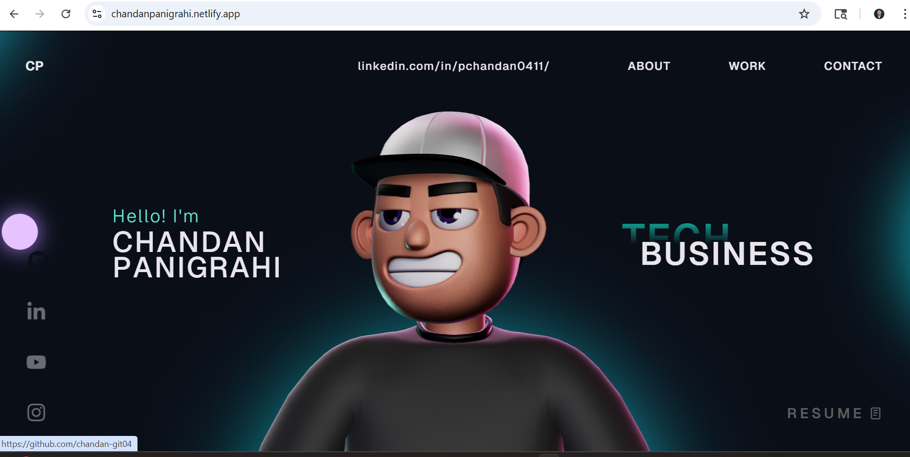

# 3D Portfolio Website

This repository contains the source code for a personal 3D portfolio built with React, TypeScript, Three.js, React Three Fiber, and GSAP. It includes animated page sections, a character scene, custom cursor interactions, and smooth transitions designed for a modern portfolio experience.

Live site: [https://chandanpanigrahi.netlify.app/](https://chandanpanigrahi.netlify.app/)

